# CS50 Final Project - Propagate Kindness
Propagate Kindness is a platform where plant parents can donate gardening items, connect with other green fingers, and read about plants and sustainability.

#### Video Demo: [PropagateKindness](https://youtu.be/1oirRXC_c1Y)

#### Description
This project is a community portal designed to help people connect with one another. If someone is in need of plants or gardening items, they can browse advertisements posted by fellow community members and contact the owners to arrange a collection of the items. All items are free and based on donations.

The website also features a blog that provides content related to gardening and sustainability. 

To message someone about an advertisement or create one, creating an account and logging in is mandatory. 

### Motivation
As someone who lives abroad and has a passion for plants, nature, and sustainable practices, I often find myself with questions about my plants. I would love to connect with others who share these interests.

Sometimes my plants have lots of babies, and I’m unsure who to give them to. Additionally, I would love to add new plants to my collection, but they’re not always affordable. So, why not create a safe space for plant lovers to share gardening items? 

### Purpose
My initial idea for this project was to create a space for people to share gardening items, but as it developed, I realized it was much more than that. It is a place to connect, share, and spread kindness.

A few months ago, while volunteering in a community garden, we had afternoon tea together, during which we were all discussing allotments. Someone said something that I will never forget: "The nice thing about allotments is being with others, talking, laughing, and sharing experiencies."

This phrase touched me deeply, and it embodies the purpose of this project: to bring people together in a world that increasingly isolates us.

### Tech Stack
For this project, I'm using:
- [C#](https://learn.microsoft.com/en-us/dotnet/csharp/tour-of-csharp/) as the main programming language
- [.NET 8 SDK](https://dotnet.microsoft.com/en-us/download)
- [ASP.NET Core MVC](https://learn.microsoft.com/en-us/aspnet/core/mvc/overview?view=aspnetcore-8.0)
- [SQL Server Express](https://www.microsoft.com/en-gb/sql-server/sql-server-downloads) as database
- HTML
- CSS
- JavaScript
- [Bootstrap CSS](https://getbootstrap.com/)
- [Azure Blob Storage](https://azure.microsoft.com/en-gb/products/storage/blobs) for saving the images

### Tech Highlights
 - Configuration with [Options Pattern](https://learn.microsoft.com/en-us/aspnet/core/fundamentals/configuration/options?view=aspnetcore-8.0)
 - [Repository Pattern](https://learn.microsoft.com/en-us/aspnet/core/fundamentals/configuration/options?view=aspnetcore-8.0) for data access
 - User password is saved using Hashing + Salting, as shown in the course
 - All the dependencies are with interface and using [Dependency Injection](https://learn.microsoft.com/en-us/dotnet/core/extensions/dependency-injection)
 - I added a unit test project with [xUnit](https://learn.microsoft.com/en-us/dotnet/core/testing/unit-testing-with-dotnet-test) but I just added a few tests (_I had to rush it, I plan to add more_)
 - [Entity Framework](https://learn.microsoft.com/en-us/ef/) for database migration and data access
 - [Result Pattern](https://code-maze.com/aspnetcore-result-pattern/) instead of exceptions for error and validation


### Usage
#### Visitor
Visitors can navigate the website without needing to log in or create an account. While browsing advertisements, visitors can view both Available and Promised items. Navigation can be done by clicking on the main card on the home page or by using the search bar to type in a keyword.
Visitors or Users can access this through a dropdown menu or view the latest eight posts displayed in a carousel at the bottom of the home page. 

##### Visitors View - Home Page
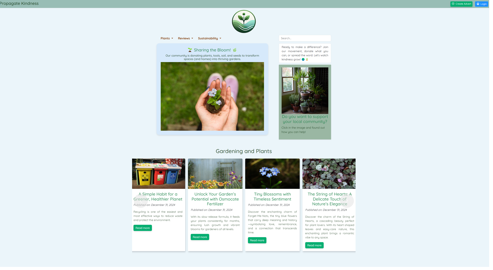

##### Visitor View - Home Page - Link to Available and Promissed Adverts
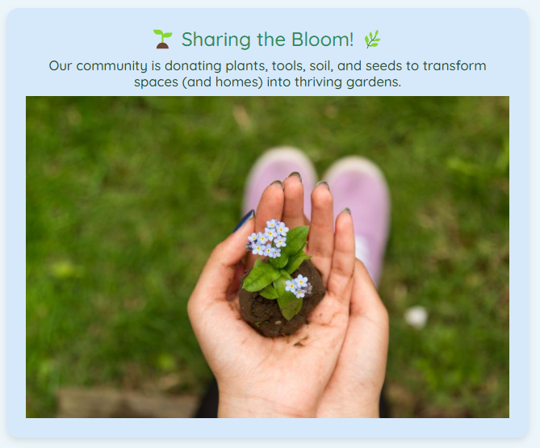

##### Visitor View - Available and Promissed Adverts with Pagination
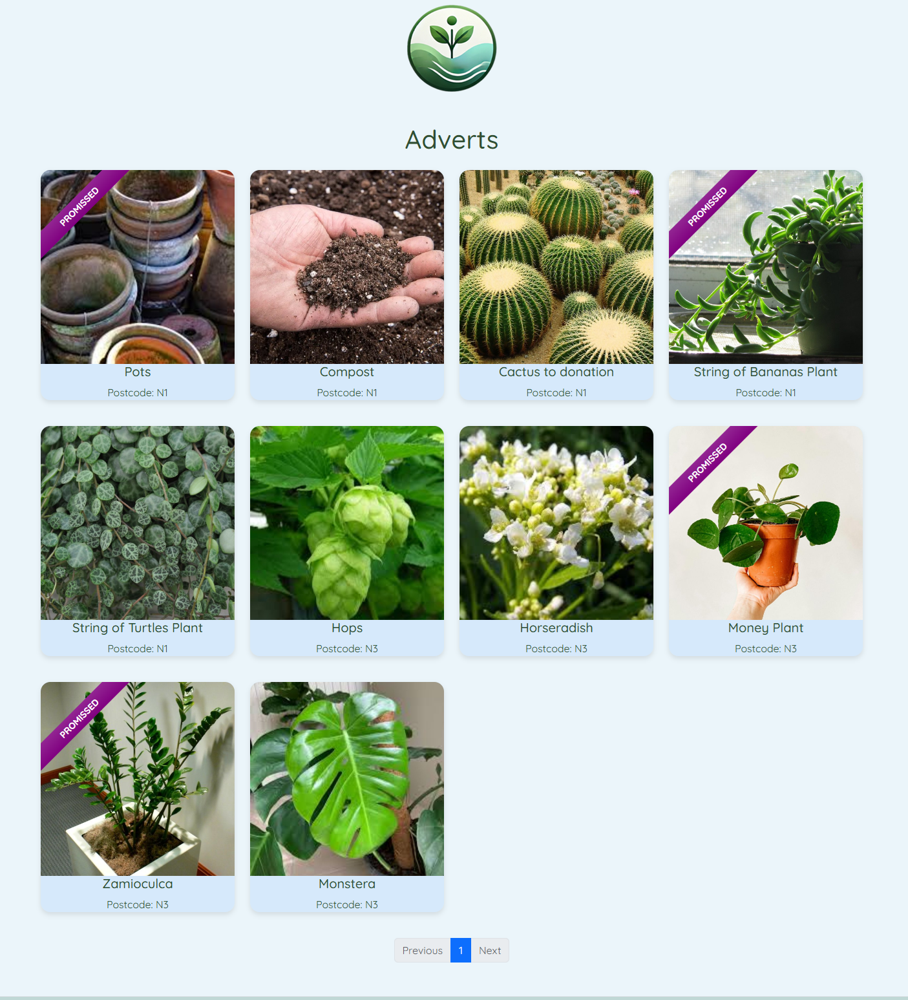

##### Visitor View - Dropdown Menu to blog contents
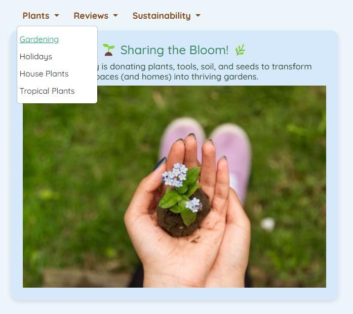

##### Visitor View - Posts with pagination
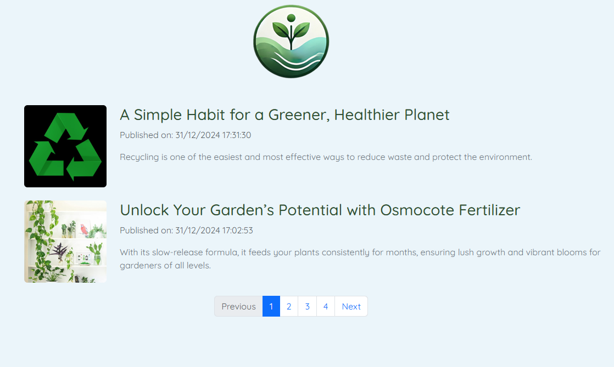

##### Visitor View - Last eight Post Publications - Carrousel
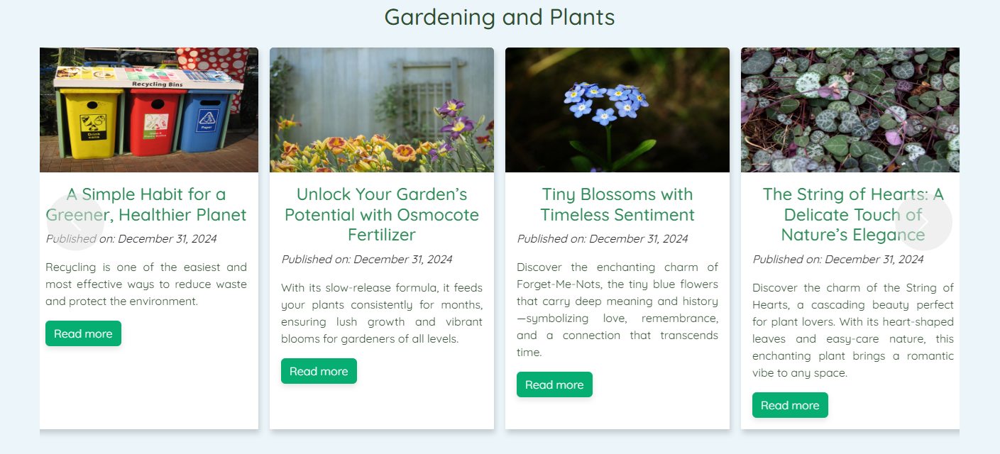

##### Visitor View - Search Bar
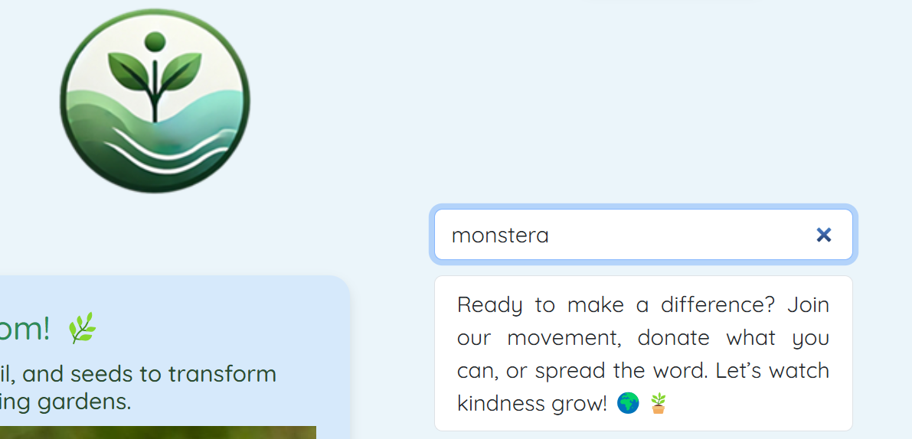


#### User

##### User View - Home Page
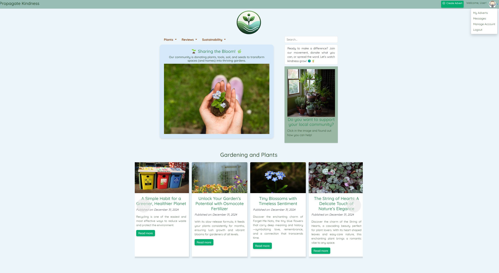

##### User View - Home Page - A better look
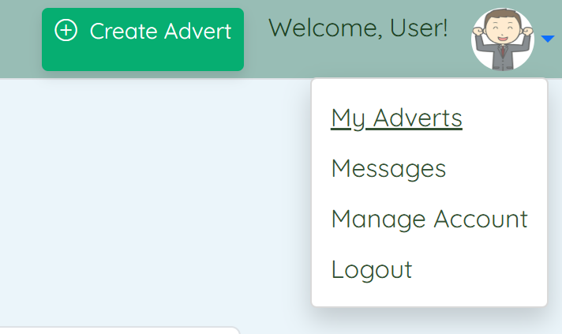

##### Account
During the account creation process, users will be asked to provide personal information, including their name, last name, photo, address, date of birth, email and password. None of these fields can be Null or Blank. There are Model Validations to assure each field is filled. The password must be between 8 and 20 characters long. The back-end system is responsible for generating a hash code and a salt before saving the information in the database. 

##### User View - Login
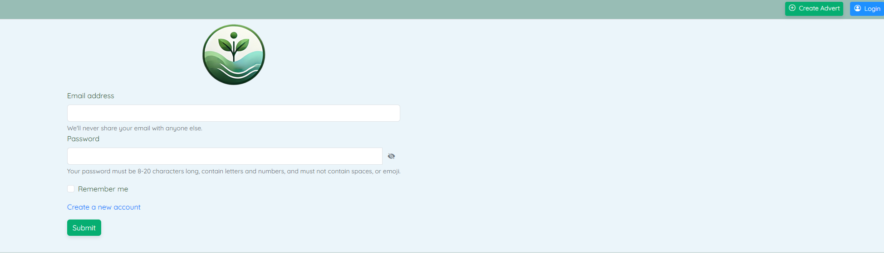

##### User View - Create Account
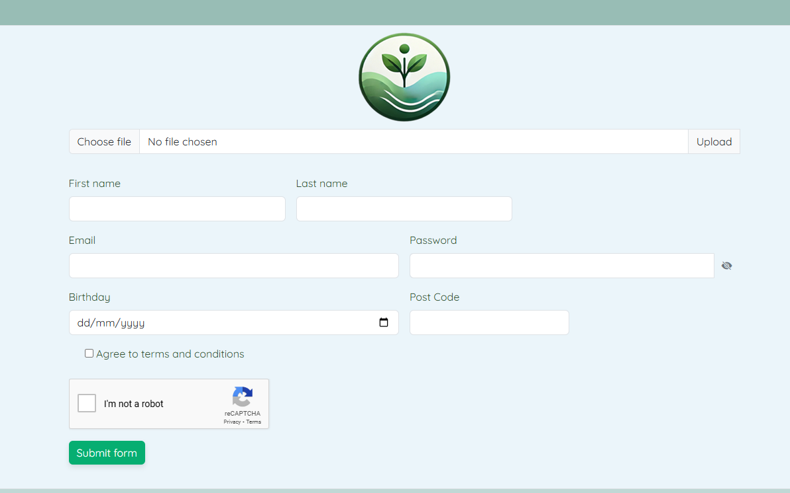

Additionally, users are allowed to edit their account information.
##### User View - Manage Account
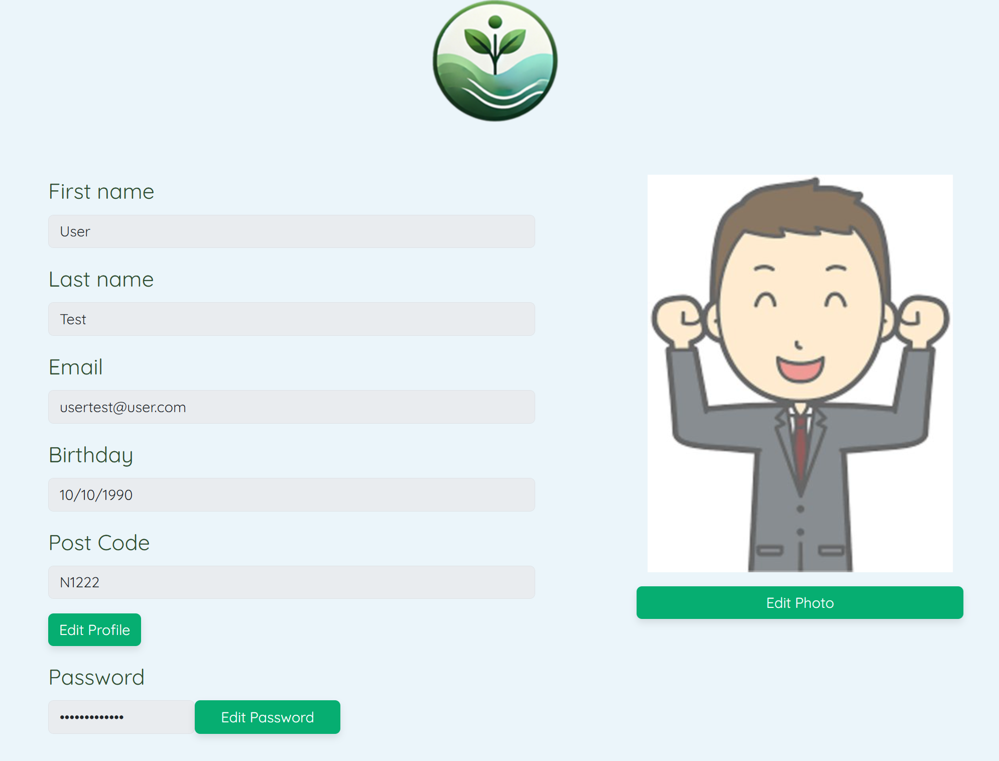

##### My Adverts
Creating an account allows users to post advertisements for items they are offering for donation.
Logged-in users can also view their own advertisements and check or change their status, which can be one of the following: Under Review, Available, Promised, Donated, or Inactive. An advertisement will only be made available after it has been approved by the user admin. 

##### User View - My Adverts
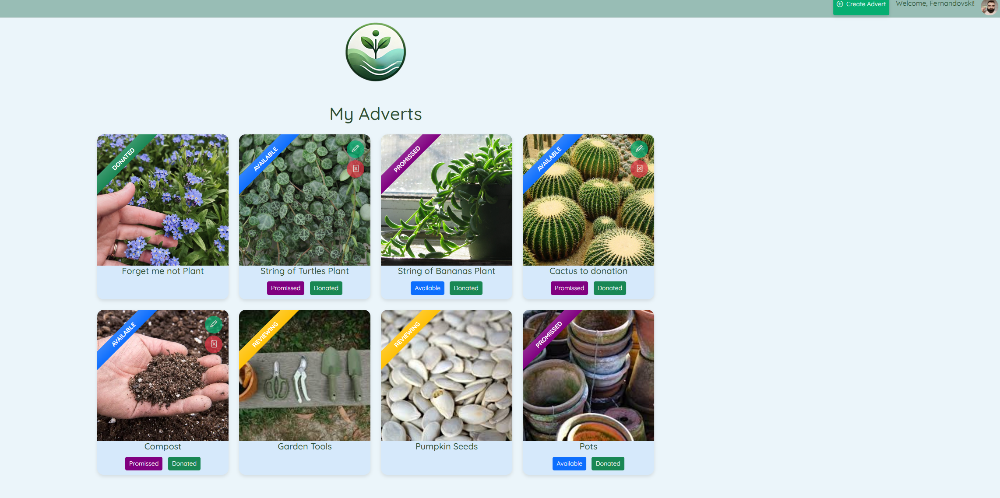

##### User View - Create Advert
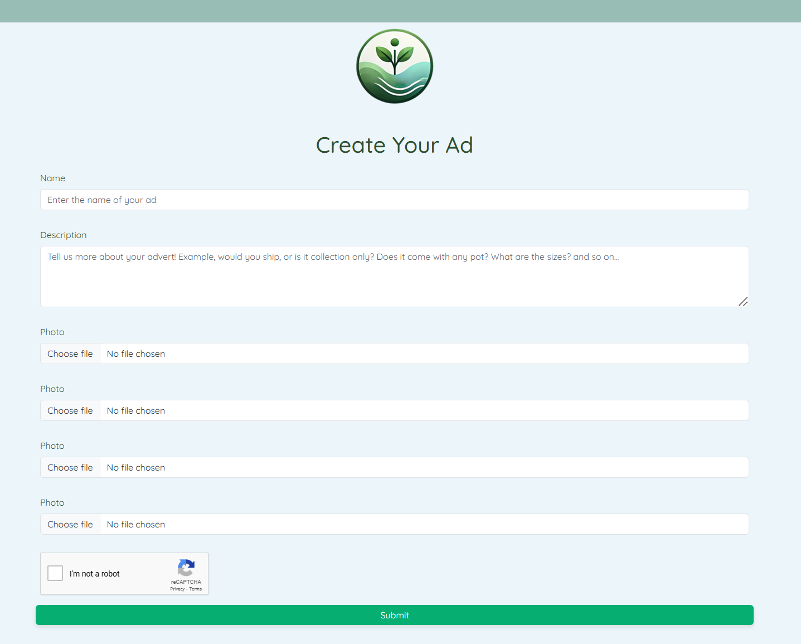

##### User View - Create Advert Displaying Model Validations
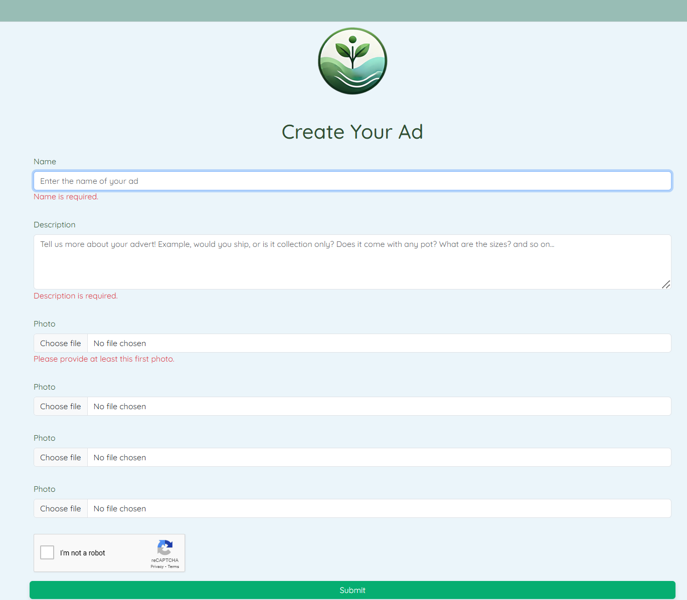

#### Adverts
##### Advert View 
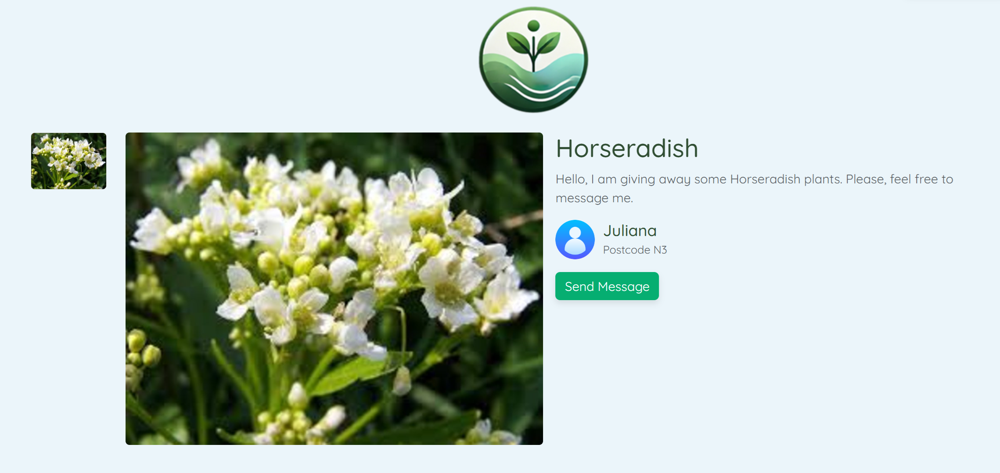

#### Messages
Being the advert Available or Promissed, the user can send to the advert owner a message. The owner also can reply it.

##### Message sent and answered
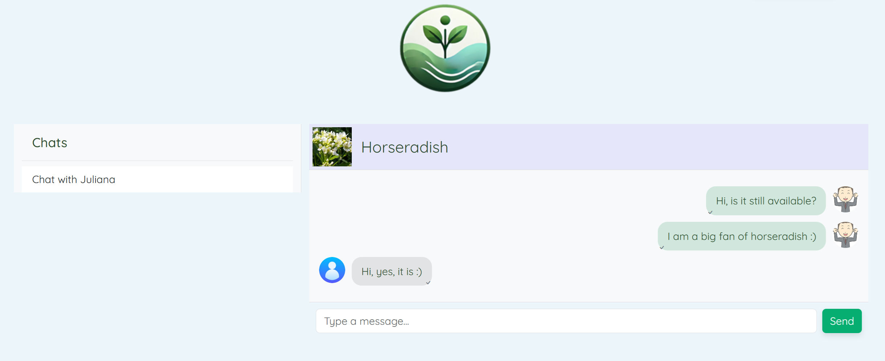

#### Blog Posts
Visitor and users have access to read the posts. Only the admin user can create a new post. It is organized by tags.
##### Post View
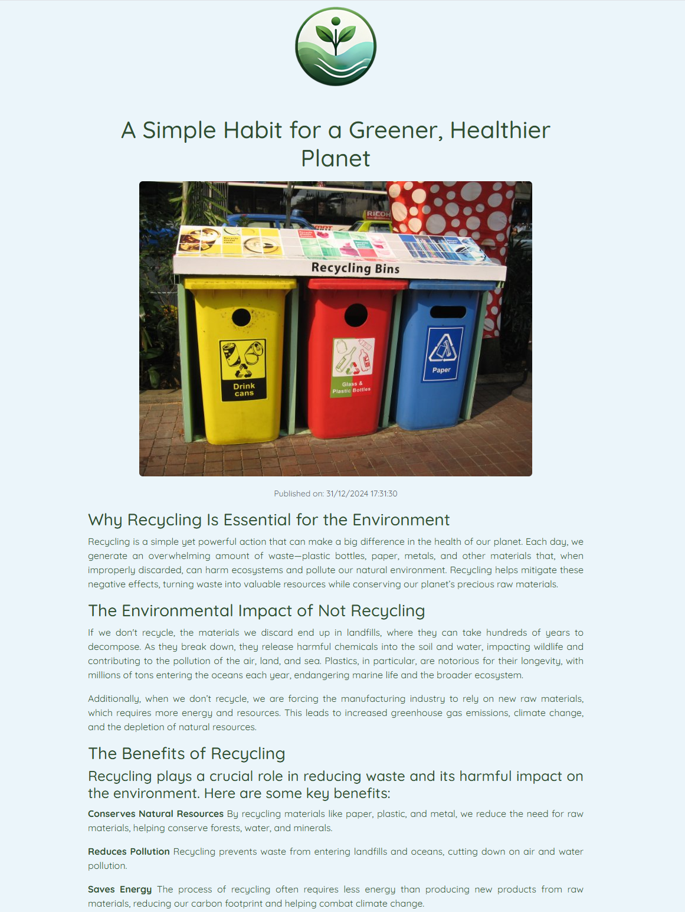


### Next Steps
I plan to add more features to the portal, including:

1. A section for gardening assistance where users can create posts to request help with gardening activities.
2. A platform for individuals to look for volunteer jobs in their communities. When navigating this section, users will be able to enter their postcode, which will redirect them to the relevant county website, where they can find all available vacancies.

Also some technical tasks:
- Add caching on the pages to avoid rendering everytime, especially the Home Page
- About page with information about me, it's on the footer but no information yet
- Create a ranking of people who donate mosts and display on the front page (Kind of a gamefication)
- Enhance the site usability and design, I'm not very good at design
- Fix chat message status, we have icons for sent and read, but only sent is being used at this time
- Make the "Rememver Me" box on login page work, or remove the checkbox altogether.
- Implement a "Forgot Password" feature for people that lost their credentials
- Better organize the CSS, it's a mess! Some elements have styles directly, and the class names could be better
- Allow searching on blog posts as well, just like we can search for adverts
- Use a better searching function, like Full-Text instead of a string contains.
- Use other Auzure services like App Configuration and SQL Database
- Deploy to Azure and make it public available, I already have a domain for it.
- Make Azure and ReCaptcha optional, parametrizeable
- Create more unit tests

### File meaning
The main project structure has teh following projects
```
.
├── PropagatingKindness
│   ├── PropagatingKindness
│   ├── PropagatingKindness.Domain
│   ├── PropagatingKindness.Infra
│   ├── PropagatingKindness.sln
│   └── PropagatingKindness.Test
├── readme_images
├── README.md
```

`README.md` and `readme_images` are used to this documentation. Then, we have:
- **PropagatingKindness**: This is the main project, containing everything related to the web view, HTML, CSS, Web Routes, and so on.
- **PropagatingKindness.Domain**: Business Rules, validations, and DB Models.
- **PropagatingKindness.Infra**: Mainly database-related code, migrations, mappings and repositories
- **PropagatingKindness.sln**: Visual Studio solution file
- **PropagatingKindness.Test**: A Unit Test project

#### PropagatingKindness Project
This project structure contains the following files:
```
.
├── appsettings.Development.json                       -> Configuration file for Development environment
├── appsettings.json                                   -> Configuration file (Global)
├── Configuration
│   ├── AzureConfiguration.cs                          -> Represents the Azure configuration
│   └── ReCaptchaConfiguration.cs                      -> Represents the ReCaptcha configuration
├── Controllers                                        -> Contains all the controllers
│   ├── AccountController.cs                           -> Responsible for the Account-related endpoints
│   ├── AdvertController.cs                            -> Responsible for the Advert-related endpoints
│   ├── BlogController.cs                              -> Responsible for the Blog-related endpoints
│   ├── ChatController.cs                              -> Responsible for the Chat-related endpoints
│   └── HomeController.cs                              -> Responsible for the Home Page endpoints
├── Models                                             -> Contains all the models, grouped by controller
│   ├── Account
│   │   ├── CreateAccountViewModel.cs                  -> Model for the Create Account webpage
│   │   ├── EditPasswordViewModel.cs                   -> Model for the Change Password webpage
│   │   ├── EditProfileViewModel.cs                    -> Model for the Edit Profile webpage
│   │   ├── LoginViewModel.cs                          -> Model for the Login webpage
│   │   └── ManageAccountViewModel.cs                  -> Model for the CManage Account webpage
│   ├── Advert
│   │   ├── AllAvailablePromissedAdvertsViewModel.cs   -> Model for the CList Adverts webpage
│   │   ├── CreateAdvertViewModel.cs                   -> Model for the Create Advert webpage
│   │   ├── EditAdvertViewModel.cs                     -> Model for the Edit Advert webpage
│   │   ├── MyAdvertsViewModel.cs                      -> Model for the My Adverts webpage
│   │   ├── PendingAdvertsViewModel.cs                 -> Model for the Pending Adverts webpage
│   │   ├── SearchAvailablePromissedAdvertsViewModel.cs-> Model for the Search Adverts webpage
│   │   └── ViewAdvertViewModel.cs
│   ├── Blog
│   │   ├── CreatePostViewModel.cs                     -> Model for the Create Blog Post webpage
│   │   ├── ListPostsViewModel.cs                      -> Model for the List Posts webpage
│   │   └── ViewPostViewModel.cs                       -> Model for the Ciew Post webpage
│   ├── Chat
│   │   ├── ChatMessagesViewModel.cs                   -> Model for the Chat page
│   │   └── MyConversationsViewModel.cs                -> Model for the Chat page
│   ├── Constants.cs                                   -> Not actually a model, just some constants
│   ├── ErrorViewModel.cs                              -> View Model for the generic Error page
│   └── SendMessageRequest.cs                          -> JSON Request for sending a message (Chat)
├── Program.cs                                         -> Application entrypoint file
├── PropagatingKindness.csproj                         -> Visual Studio CSPROJ file
├── Properties
│   └── launchSettings.json                            -> VSCode file
├── Services                                           -> Services used in the Web project
│   ├── EnsureUserImageActionFilter.cs          -> Action Filter to ensure the user image is in ViewBag
│   ├── IPhotosManagerService.cs                -> Service for uploading to Azure Blob Storage
│   ├── IReCaptchaService.cs                    -> ReCaptcha validation service
│   └── RequiresAdminAttribute.cs               -> Attribute to ensure only admin user access certain endpionts
├── Views                                       -> Contains all the views rendered by the controllers
│   ├── Account
│   │   ├── CreateAccount.cshtml                -> View for the Create Account webpage
│   │   ├── EditPassword.cshtml                 -> View for the Edit Password webpage
│   │   ├── EditProfile.cshtml                  -> View for the Edit Profile webpage
│   │   ├── Error.cshtml                        -> View for the Error webpage 
│   │   ├── Login.cshtml                        -> View for the Login webpage
│   │   └── ManageAccount.cshtml                -> View for the Manage Account webpage
│   ├── Advert
│   │   ├── All.cshtml                          -> View for the Adverts Listing webpage
│   │   ├── CreateAdvert.cshtml                 -> View for the Create Advert webpage 
│   │   ├── Donation.cshtml                     -> View for the Donation webpage
│   │   ├── Edit.cshtml                         -> View for the Edit Advert webpage
│   │   ├── MyAdverts.cshtml                    -> View for the My Adverts webpage
│   │   ├── Pending.cshtml                      -> View for the Pending Adverts webpage
│   │   ├── Search.cshtml                       -> View for the Advert Search webpage
│   │   └── View.cshtml                         -> View for the View Advert webpage 
│   ├── Blog
│   │   ├── CreatePost.cshtml                   -> View for the Create Post webpage 
│   │   ├── ListPosts.cshtml                    -> View for the Blog Post Listing webpage
│   │   └── ViewPost.cshtml                     -> View for the View Blog Post webpage
│   ├── Chat
│   │   └── MyConversations.cshtml              -> View for the Chat webpage  
│   ├── Home
│   │   ├── Index.cshtml                        -> View for the Home Page webpage
│   │   └── Privacy.cshtml                      -> View for the generic .NET Privacy webpage 
│   ├── Shared
│   │   ├── Error.cshtml                        -> ASP.NET Default Error View
│   │   ├── _Layout.cshtml                      -> ASP.NET Default _Layout View
│   │   ├── _Layout.cshtml.css                  -> ASP.NET Default _Layout View
│   │   └── _ValidationScriptsPartial.cshtml    -> ASP.NET Default ValidationScripts Partial View
│   ├── _ViewImports.cshtml                     -> ASP.NET Default View Imports
│   └── _ViewStart.cshtml                       -> ASP.NET Default View Start
└── wwwroot                                     -> Contains static files
    ├── css                                     -> Contains CSS
    │   ├── site.css                            -> ASP.NET Default CSS File
    │   └── styles.css                          -> My styles CSS File
    ├── favicon.ico                             -> favicon
    ├── images                                  -> Containes some static files
    │   ├── Houseplants.jpg
    │   ├── logo.png
    │   ├── logo-resized.png
    │   ├── poinsettia1000px.png
    │   ├── poinsettia500px.png
    │   ├── poinsettia.jpg
    │   └── poinsettia.png
    ├── js                                      -> Contains the site Javascript files
        ├── chat.js                             -> Javascript specific to the chat page
    │   └── site.js                             -> Generic javascript
    └── lib                                     -> ASP.NET Default lib folder
        ├── bootstrap                           -> Bootstrap folder
        ├── jquery                              -> JQuery Folder
        ├── jquery-validation                   -> JQuery Validation Folder
        └── jquery-validation-unobtrusive       -> JQuery Validation Folder
```

#### PropagatingKindness.Domain Project
This project contains the following files
```
├── DTO                                 -> DTOs, used by the WebProject to pass a representation to services
│   ├── AdvertDTO.cs                    -> Represent a soon to be Advert
│   ├── BlogDTO.cs                      -> Represent a soon to be Blog
│   ├── Result.cs                       -> Result Pattern file
│   └── UserDTO.cs                      -> Represent a soon to be User
├── Interfaces                          -> Contains some interfaces
│   ├── IAdvertRepository.cs            -> Interface for the Advert Repository
│   ├── IAdvertService.cs               -> Interface for the Advert Service
│   ├── IBlogRepository.cs              -> Interface for the Blog Repository
│   ├── IBlogService.cs                 -> Interface for the Blog Service
│   ├── IChatRepository.cs              -> Interface for the Chat Repository
│   ├── IChatService.cs                 -> Interface for the Chat Service
│   ├── IUserRepository.cs              -> Interface for the User Repository
│   └── IUserService.cs                 -> Interface for the User Service
├── Models                              -> Contains the database models (entities)
│   ├── Advert.cs                       -> Advert model
│   ├── BlogPostContent.cs              -> BlogPost Content model
│   ├── BlogPost.cs                     -> BlogPost Model
│   ├── Chat.cs                         -> Chat Model
│   ├── GardeningHelp.cs                -> Gardening Help Model (future)
│   ├── Message.cs                      -> Chat Message Model
│   ├── Photo.cs                        -> Advert Photo Model
│   ├── Tag.cs                          -> Blog Post Tag Model
│   └── User.cs                         -> User Model
├── PropagatingKindness.Domain.csproj   -> .NET Project file
├── Services                            -> Contains some services, for business logic and validations
│   ├── AdvertService.cs                -> Rules related to Adverts
│   ├── BlogService.cs                  -> Rules related to Blog
│   ├── ChatService.cs                  -> Rules related to Chat
│   ├── HashingHelper.cs                -> Helper for handling hashing
│   └── UserService.cs                  -> Rules related to User
```

#### PropagatingKindness.Infra Project
This project contains the following file/folder structure:
```
├── Db
│   └── PlantsDbContext.cs              -> Entity Framework DB Context
├── Mappings                            -> Several Entity Framework Mappins / Table Definitions
│   ├── AdvertMapping.cs                -> Entity Framework Mapping for Advert
│   ├── BlogPostContentMapping.cs       -> Entity Framework Mapping for Blog Post Content
│   ├── BlogPostMapping.cs              -> Entity Framework Mapping for Blog Post
│   ├── ChatMapping.cs                  -> Entity Framework Mapping for Chat
│   ├── GardeningHelpMapping.cs         -> Entity Framework Mapping for Gardening Help
│   ├── MessageMapping.cs               -> Entity Framework Mapping for Chat Message
│   ├── PhotoMapping.cs                 -> Entity Framework Mapping for Advert Photos
│   ├── TagMapping.cs                   -> Entity Framework Mapping for Blog Post Tag
│   └── UserMapping.cs                  -> Entity Framework Mapping for User
├── Migrations                          -> Entity Frameowkr Migrations
│   ├── 20241212154319_Creating_DataBase.cs
│   ├── 20241212154319_Creating_DataBase.Designer.cs
│   ├── 20241213104236_Fixing_Length_Password.cs
│   ├── 20241213104236_Fixing_Length_Password.Designer.cs
│   ├── 20241225121936_AddingUserAccessLevel.cs
│   ├── 20241225121936_AddingUserAccessLevel.Designer.cs
│   ├── 20241225140628_AddCreatedDateToAdvert.cs
│   ├── 20241225140628_AddCreatedDateToAdvert.Designer.cs
│   ├── 20241228180250_AddingChat.cs
│   ├── 20241228180250_AddingChat.Designer.cs
│   ├── 20241230164637_AddingPropertyCoverImageToBlog.cs
│   ├── 20241230164637_AddingPropertyCoverImageToBlog.Designer.cs
│   └── PlantsDbContextModelSnapshot.cs
├── PropagatingKindness.Infra.csproj    -> .NET Project File
├── Repository                          -> Repositories
│   ├── AdvertRepository.cs             -> Advert Repository
│   ├── BlogRepository.cs               -> Blog Repository
│   ├── ChatRepository.cs               -> Chat Repository
│   └── UserRepository.cs               -> User Repository
```


### Running the aplication
As this code relies on Azure to save the images, running it with full capabilities might be trickier. You'd need to subscribe to Azure, create a new Storage Account, create some containers, correctly set the anonymous permission, get some Azure tokens, and so on. It's not explicitly required, but if not done, features that rely on image upload will not work.

You'd also need to subscribe to Google Cloud in order to use ReCaptcha.

On a bare minimum, in order to run the project you'll need:
1. Ensure you have `git` installed and clone this repository.
2. Install both C#/.NET SDK and Visual Studio (they are both free)
3. Have a SQL Server installation (Local, on  [Docker](https://hub.docker.com/r/microsoft/mssql-server) or cloud)
4. Open this solution on Visual Studio.
5. Fill the parameters on `appsettings.json` as required, especially the `ConnectionString` part.
6. On Visual Studio, navigate to `Tools -> Nuget -> Nuget Package Manager Console`. On the console that opened, select the project ending with `.Infra` and run:

```
> Update-Database
```

After that, you should be able to run the project.